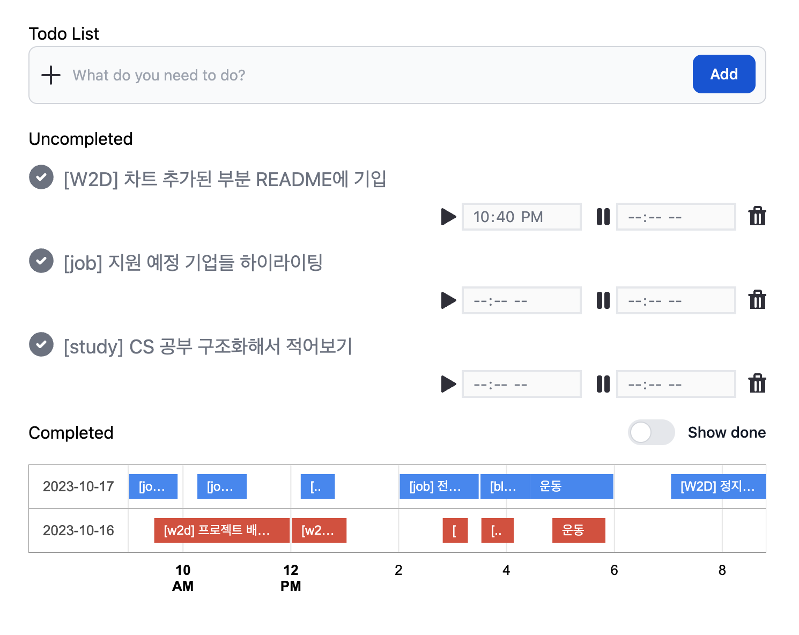
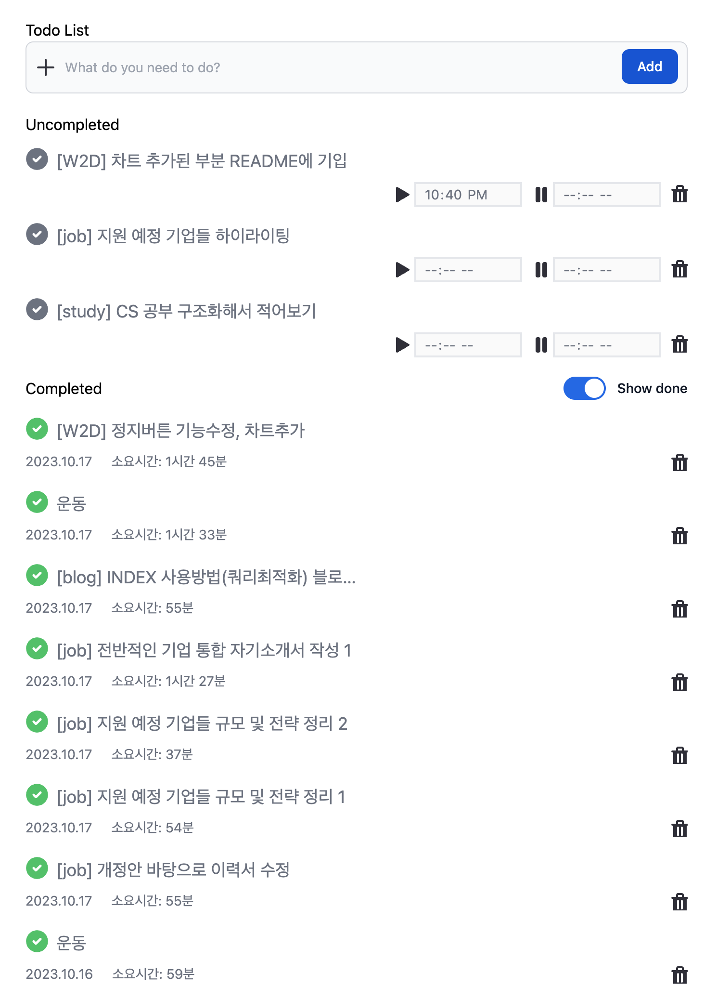

# Whattodo
## 프로젝트 설명
- 😵 단순한 투두리스트가 아닙니다.
- ⌛️ 한 업무를 진행할 때, **시작시간과 끝시간을 함께 기록**하여 업무에 더욱 집중할 수 있습니다.
- 🥥 간편한 Kakao Oauth2 가입만으로 사용할 수 있습니다.

### 프로젝트를 시작한 이유
- 무거운 프레임워크를 사용해왔는데 가벼운 프레임워크도 사용해보신 적 있나요? 라는 질문에  
  '평소에 관심있었던 go 언어로 프로젝트를 만들어보고 싶다!'고 생각하게 되어서 기획하기 시작했습니다.
- 🦔 Golang의 gin 프레임워크를 이용하여 개발한 첫 번째 프로젝트입니다.
- 🗓 저는 시간을 가장 중요하게 생각합니다. todo 리스트를 채우는 것만으로는 시간관리를 어떻게 했는지 알 수 없다는 것이 아쉬웠습니다.
- 🛢 각각의 태스크를 연속적으로 시각화할 수 있다면, 나의 하루를 데이터화하여 측정할 수 있을 것이라고 생각했습니다.
- 🏃🏻‍♂️ 그렇기 때문에! 이 프로젝트는 아직 가야할 길이 멀다고 느낍니다. 아래 개발 예정 항목들을 꾸준히 개발해 나가겠습니다.

### 기술 설명
- Kakao Oauth2를 활용하여 간단하게 회원가입합니다.
- gorm과 sqlite3를 사용하여 빠르게 3-tier 서버 아키텍처를 구성하였습니다.
- 프로젝트를 Docker container로 구성하여 Docker compose를 사용한 빠른 배포환경을 설정하였습니다.
- Frontend Framework를 사용하지 않고, 순수 javascript와 axios를 통해 golang REST API 서버와 통신합니다.
- google chart를 사용하여 하루 수행한 투두 리스트를 시간순서로 나열합니다.

### 서비스 데모
#### 데모 이미지

#### 데모사이트: [간단한 가입과 함께 whattodo 사용해보세요!](http://www.devyam.net:8080/)